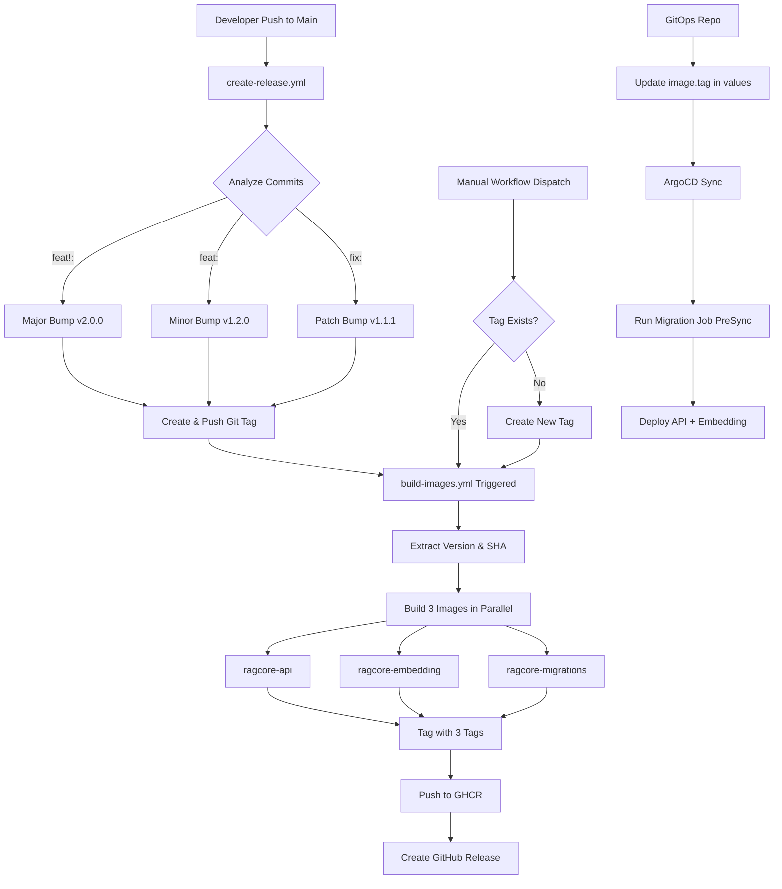

# Comprehensive Deployment Plan for RAG Framework

**Created**: 2025-11-21
**Updated**: 2025-11-21
**Status**: Approved - Ready for Implementation
**Version**: 2.0

---

## 🏗️ Architecture Overview

### Services to Build & Deploy:
1. **ragcore-api** - Main .NET API (RAG.API)
2. **ragcore-embedding** - Python embedding service
3. **ragcore-migrations** - EF Core migrations bundle (efbundle)

### External Dependencies (not built, referenced in Helm):
- PostgreSQL
- Elasticsearch
- Qdrant
- Keycloak
- MinIO
- Valkey (Redis alternative)

---

## 📦 Component Breakdown

### 1. **Docker Images** (3 total)

#### 1.1 `ragcore-api`
- **Purpose**: Main ASP.NET Core API application
- **Base**: `mcr.microsoft.com/dotnet/aspnet:8.0`
- **Build**: Multi-stage build with SDK for compilation
- **Responsibilities**: REST API, business logic, health checks
- **Exposed Port**: 8080 (non-root)

#### 1.2 `ragcore-embedding`
- **Purpose**: Python FastAPI embedding service
- **Base**: `python:3.11-slim`
- **Responsibilities**: Generate embeddings via sentence-transformers
- **Exposed Port**: 8001
- **Note**: Already has Dockerfile, will be updated for production

#### 1.3 `ragcore-migrations`
- **Purpose**: EF Core migrations as bundle (efbundle)
- **Base**: `mcr.microsoft.com/dotnet/runtime:8.0-alpine`
- **Build**: Creates standalone executable via `dotnet ef migrations bundle`
- **Execution**: Runs as Kubernetes Job (ArgoCD preSync hook)
- **Output**: Single binary that applies migrations to Postgres

---

### 2. **GitHub Actions Workflows** (3 workflows)

#### 2.1 `create-release.yml` (Trigger: push to main)
**Purpose**: Creates git tags based on commit messages

**Flow**:
```
Push to main
  ↓
Parse commits for version bump type (major/minor/patch)
  ↓
Fetch latest git tag (v{major}.{minor}.{patch})
  ↓
Increment version based on commit messages
  ↓
Create & push new git tag
  ↓
Trigger build-images.yml via tag push event
```

**Commit Message Convention**:
- `BREAKING CHANGE:` or `feat!:` → major bump
- `feat:` → minor bump
- `fix:`, `chore:`, etc. → patch bump

**Output**: New git tag like `v1.2.3`

---

#### 2.2 `build-images.yml` (Trigger: git tag push OR manual dispatch)
**Purpose**: Build and push all 3 Docker images to GHCR

**Flow**:
```
Tag created (v{major}.{minor}.{patch})
  ↓
Extract version from tag
  ↓
Calculate short SHA (first 7 chars)
  ↓
Build 3 images in parallel:
  ├─ ragcore-api
  ├─ ragcore-embedding
  └─ ragcore-migrations
  ↓
Tag each image with 3 tags:
  ├─ latest
  ├─ v{major}.{minor}-{short-sha}
  └─ v{major}.{minor}.{patch}-{short-sha}
  ↓
Push to ghcr.io/bardin08/ragframework/
  ↓
Create GitHub Release with changelog
```

**Manual Dispatch**:
- Input: existing tag (e.g., `v1.2.3`)
- If tag doesn't exist: error, or optionally create new tag
- Rebuilds images with same tag

**Registry Path**: `ghcr.io/bardin08/ragframework/{image-name}:{tag}`

**Authentication**: Uses `GITHUB_TOKEN` with `packages: write` permission

---

#### 2.3 `ci.yml` (Trigger: PR to main, push to feature branches)
**Purpose**: CI checks (no deployments)

**Flow**: Already exists, enhanced to:
- Build & test .NET solution
- Build (but not push) Docker images for validation
- Run integration tests with TestContainers
- Security scanning (Trivy)

---

### 3. **Helm Chart Structure**

```
helm/
├── Chart.yaml                 # Chart metadata
├── values.yaml               # Default values (tool-agnostic)
├── templates/
│   ├── _helpers.tpl          # Template helpers
│   ├── deployment-api.yaml   # API deployment
│   ├── deployment-embedding.yaml  # Embedding service
│   ├── service-api.yaml      # API service
│   ├── service-embedding.yaml     # Embedding service
│   ├── ingress.yaml          # Optional ingress (if enabled)
│   ├── configmap.yaml        # App configuration
│   ├── hpa.yaml              # Horizontal Pod Autoscaler (optional)
│   ├── job-migrations.yaml   # Migration job (preSync)
│   ├── dependencies/
│   │   ├── postgres.yaml     # PostgreSQL StatefulSet
│   │   ├── valkey.yaml       # Valkey deployment
│   │   ├── elasticsearch.yaml # Elasticsearch StatefulSet
│   │   ├── qdrant.yaml       # Qdrant StatefulSet
│   │   ├── keycloak.yaml     # Keycloak deployment
│   │   └── minio.yaml        # MinIO deployment
│   └── serviceaccount.yaml   # Service account for pods
└── .helmignore
```

**Note**: Environment-specific values (dev/staging/prod) will be managed in the gitops repository, not in this repo.

---

### 4. **Version Management Strategy**

**Single Source of Truth**: Git tags in format `v{major}.{minor}.{patch}`

**Helm Chart Variables**:
```yaml
# values.yaml
image:
  tag: ""  # Injected by ArgoCD/gitops, e.g., "v1.2.3-abc1234"

# All 3 services use the SAME tag
api:
  image: ghcr.io/bardin08/ragframework/ragcore-api
  tag: "{{ .Values.image.tag }}"

embedding:
  image: ghcr.io/bardin08/ragframework/ragcore-embedding
  tag: "{{ .Values.image.tag }}"

migrations:
  image: ghcr.io/bardin08/ragframework/ragcore-migrations
  tag: "{{ .Values.image.tag }}"
```

**Deployment Flow**:
1. Developer pushes to main → `create-release.yml` creates tag `v1.2.3`
2. Tag push → `build-images.yml` builds 3 images with tags:
   - `v1.2-abc1234`
   - `v1.2.3-abc1234`
   - `latest`
3. In **gitops repo**, you set: `image.tag: v1.2.3-abc1234`
4. ArgoCD syncs → all 3 services use compatible versions

---

### 5. **Migration Job Configuration**

**Tool-Agnostic Design**: Job is defined in Helm, ArgoCD triggers it via annotations

**Helm Template** (`job-migrations.yaml`):
```yaml
{{- if .Values.migrations.enabled }}
apiVersion: batch/v1
kind: Job
metadata:
  name: {{ include "ragframework.fullname" . }}-migrations
  annotations:
    argocd.argoproj.io/hook: PreSync  # ArgoCD-specific, ignored by helm
    argocd.argoproj.io/hook-delete-policy: BeforeHookCreation
spec:
  backoffLimit: 0  # Fail-fast, no retries
  template:
    spec:
      restartPolicy: Never
      containers:
      - name: migrations
        image: "{{ .Values.migrations.image }}:{{ .Values.image.tag }}"
        env:
        - name: ConnectionStrings__DefaultConnection
          valueFrom:
            secretKeyRef:
              name: postgres-connection  # Managed by gitops
              key: connection-string
        resources:
          requests:
            memory: "128Mi"
            cpu: "100m"
          limits:
            memory: "256Mi"
            cpu: "500m"
{{- end }}
```

**Configuration Options** (values.yaml):
```yaml
migrations:
  enabled: true  # Set to false for first deployment or manual migration control
  image: ghcr.io/bardin08/ragframework/ragcore-migrations
```

**How it works**:
- **Fail-fast**: `backoffLimit: 0` ensures no retry attempts
- **Optional**: Can be disabled via `migrations.enabled: false` in values
- **With ArgoCD**: Annotation triggers job before deployment
- **With plain Helm**: Job is created/run on `helm install/upgrade`
- **Secrets**: Managed in gitops repository (SealedSecrets, External Secrets Operator, etc.)

**Use Cases**:
- Set `migrations.enabled: false` for first deployment to create DB schema manually
- Set `migrations.enabled: true` for subsequent deployments with automatic migrations

---

## 🔄 CI/CD Workflow Diagram



---

## 🔐 Security & Best Practices

### Image Security:
- **Non-root users** in all Dockerfiles
- **Multi-stage builds** to minimize image size
- **Security scanning** with Trivy in CI
- **Distroless/Alpine** base images where possible

### Secrets Management:
- **No secrets in this repo** - all managed in gitops
- **GHCR authentication** via `GITHUB_TOKEN` (automatic)
- **Postgres credentials** via Kubernetes Secrets (gitops)

### Helm Best Practices:
- **Resource limits & requests** defined in values.yaml for all services
- **Health checks** (liveness/readiness probes)
- **Labels & annotations** for observability
- **Security contexts** (runAsNonRoot, readOnlyRootFilesystem)

### Resource Allocation Strategy:
**Default resource quotas per service** (tunable via values.yaml):

```yaml
# API Service
api:
  resources:
    requests:
      memory: "256Mi"
      cpu: "200m"
    limits:
      memory: "512Mi"
      cpu: "1000m"

# Embedding Service
embedding:
  resources:
    requests:
      memory: "512Mi"  # Model loading requires more memory
      cpu: "500m"
    limits:
      memory: "2Gi"
      cpu: "2000m"

# PostgreSQL
postgres:
  resources:
    requests:
      memory: "256Mi"
      cpu: "250m"
    limits:
      memory: "1Gi"
      cpu: "1000m"

# Elasticsearch
elasticsearch:
  resources:
    requests:
      memory: "1Gi"
      cpu: "500m"
    limits:
      memory: "2Gi"
      cpu: "1000m"

# Qdrant
qdrant:
  resources:
    requests:
      memory: "512Mi"
      cpu: "250m"
    limits:
      memory: "1Gi"
      cpu: "1000m"

# Keycloak
keycloak:
  resources:
    requests:
      memory: "512Mi"
      cpu: "250m"
    limits:
      memory: "1Gi"
      cpu: "500m"

# MinIO
minio:
  resources:
    requests:
      memory: "256Mi"
      cpu: "100m"
    limits:
      memory: "512Mi"
      cpu: "500m"

# Valkey
valkey:
  resources:
    requests:
      memory: "128Mi"
      cpu: "100m"
    limits:
      memory: "256Mi"
      cpu: "500m"
```

**Note**: These are reasonable starting values and can be tuned in gitops repo based on actual workload.

---

## 📝 Files to Create

### Dockerfiles (3):
1. `/src/RAG.API/Dockerfile`
2. `/python-services/embedding-service/Dockerfile` (update existing)
3. `/src/RAG.Infrastructure/Migrations.Dockerfile`

### GitHub Actions (3):
1. `/.github/workflows/create-release.yml`
2. `/.github/workflows/build-images.yml`
3. Update `/.github/workflows/ci.yml`

### Helm Chart (~18 files):
1. `/helm/Chart.yaml`
2. `/helm/values.yaml`
3. `/helm/templates/*` (all template files)
4. `/helm/.helmignore`

**Note**: No environment-specific values files in this repo. Network policies excluded from scope.

### Documentation:
1. `/docs/deployment/README.md` - Deployment guide
2. `/docs/deployment/DEVELOPMENT.md` - Local development
3. `/docs/deployment/VERSIONING.md` - Version strategy

---

## ✅ Validation Plan

1. **Build locally**: All 3 Dockerfiles build successfully
2. **CI pipeline**: Workflows execute without errors
3. **Helm validation**: `helm template` renders correctly
4. **Helm lint**: No warnings or errors
5. **Test deployment**: Deploy to local k3s cluster
6. **Migration test**: Verify efbundle runs successfully
7. **Integration test**: Full API smoke test in cluster

---

## 🎯 Key Design Decisions

### Image Versioning:
- **3 images**: API, Embedding, Migrations (all versioned together)
- **Single tag**: All services use same version tag for compatibility
- **3 tags per image**: `latest`, `v{major}.{minor}-{sha}`, `v{major}.{minor}.{patch}-{sha}`

### CI/CD Strategy:
- **3 workflows**: Release creation, Image building, CI checks
- **Conventional commits**: Automatic version bumping based on commit messages
- **Manual trigger**: Rebuild existing tags via workflow dispatch

### Helm Design:
- **Tool-agnostic**: Jobs work with or without ArgoCD
- **Single chart**: All services in one deployable unit
- **Secrets in gitops**: This repo stays clean, secrets managed externally
- **Dependencies included**: All required services (Postgres, Qdrant, etc.) in chart

### Migration Strategy:
- **efbundle**: Standalone migration executable
- **PreSync hook**: Migrations run before deployment (ArgoCD)
- **Job-based**: Kubernetes Job for reliability and logging
- **Fail-fast**: No retries (`backoffLimit: 0`)
- **Optional**: Can be disabled via `migrations.enabled: false`

---

## 🚀 Implementation Order

1. **Phase 1: Dockerfiles** - Build all 3 images locally
2. **Phase 2: GitHub Actions** - Create workflows, test on feature branch
3. **Phase 3: Helm Chart** - Create chart structure and templates
4. **Phase 4: Testing** - Validate everything works end-to-end
5. **Phase 5: Documentation** - Complete deployment guides

---

## 📋 Review Checklist

- [ ] All 3 images build correctly
- [ ] Image versioning strategy is clear
- [ ] GitHub Actions workflows are well-structured
- [ ] Helm chart is tool-agnostic
- [ ] Migration job works with ArgoCD preSync
- [ ] Secrets are managed in gitops (not here)
- [ ] Security best practices implemented
- [ ] Documentation is comprehensive

---

## ✅ Review Responses & Implementation

### 1. Monitoring Integration
**Question**: Should we include optional monitoring (Prometheus metrics, Grafana dashboards)?
**Answer**: Monitoring stack already exists at cluster level.
**Decision**: Out of scope for now. Will be added as separate task for service integration with existing monitoring.

### 2. Environment-Specific Values
**Question**: Do you want separate Helm values files for dev/staging/prod in this repo?
**Answer**: No, managed in gitops.
**Implementation**:
- ✅ Single `values.yaml` with sensible defaults
- ✅ Environment-specific overrides managed in gitops repository

### 3. Migration Job Strategy
**Question**: Should the migration job have retry logic or fail-fast?
**Answer**: Fail-fast, with option to disable from values file.
**Implementation**:
- ✅ `backoffLimit: 0` for fail-fast behavior
- ✅ `migrations.enabled: true/false` flag in values.yaml
- ✅ Can be disabled for first deployment to manually create DB

### 4. Namespace Support
**Question**: Do you need support for multiple Kubernetes namespaces?
**Answer**: No, namespace created and managed in gitops repo.
**Implementation**:
- ✅ Helm chart is namespace-agnostic
- ✅ Deployed to namespace specified in gitops

### 5. Resource Quotas
**Question**: Should we include resource quotas in the Helm chart?
**Answer**: Yes, set reasonable values for tuning later.
**Implementation**:
- ✅ Resource requests & limits for all 8 services
- ✅ Tunable via values.yaml
- ✅ Reasonable defaults based on service requirements

## ✅ All Feedback Implemented

- **Removed**: `values-dev.yaml` and `values-prod.yaml` from Helm chart structure
- **Removed**: `networkpolicy.yaml` template (out of scope)
- **Added**: Fail-fast migration job with enable/disable flag
- **Added**: Resource quotas for all services with reasonable defaults
- **Updated**: File count from ~20 to ~18 files
- **Clarified**: Environment-specific values managed in gitops repository
- **Clarified**: Monitoring integration deferred to separate task
- **Clarified**: Single namespace deployment model

---

**Next Steps**: Review this plan, provide feedback, and approve to proceed with implementation.
